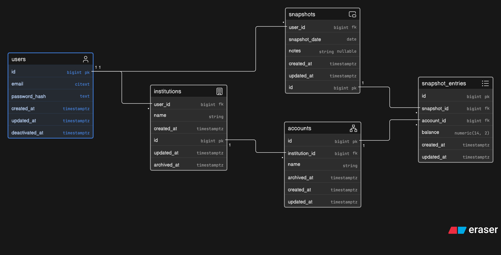

# Personal Finance Tracker

This repository is the source code for a personal finance tracking web application. 

## Purpose

The intial idea is to provide the functionality to manage (add, delete, update, archive) your accounts and then to "snapshot" your account balances on a particular date in order to track your finances over time. 

The main purpose is to replace a spreadsheet that I have been using for many years however as the accounts I use change (archiving savings spaces or simply changing banks) the complexity of managing the spreadsheet increases. And hopefully over time I can add more functionality this way. 

## Prerequisites

- sbt 1.12.14
- Java 21.0.6
- docker 29.6.2
- docker-compose 5.3.1
- docker-desktop (as daemon)

## Run locally

Start the service 

```bash 
scripts/dev-start.sh
```

This script runs the `scripts/db-up.sh` script and then `sbt run`. The `db-up.sh` script:  

1. makes sure that docker desktop is running
2. runs docker compose up provided the dev db port is not already in use
3. runs the `scripts/flyway-migrate.sh` which ensures both dev and test db's are up to date with their schema

Provided everything ran successfully, you should be able to navigate to `http://localhost:9000`. 

### Postgres

As mentioned before this project makes use of two local postgres db's ran via docker containers. One for locally running application (dev) and one for the test's to make use of (test). 

This script set's up the databases locally: 

```bash
scripts/db-up.sh
```

You can validate that postgres is set up locally by running the following command to connect to the dev one: 

```bash 
scripts/connect-to-db.sh
```

which will make sure that you can actually connect to the development database locally. 

## Database Schema

